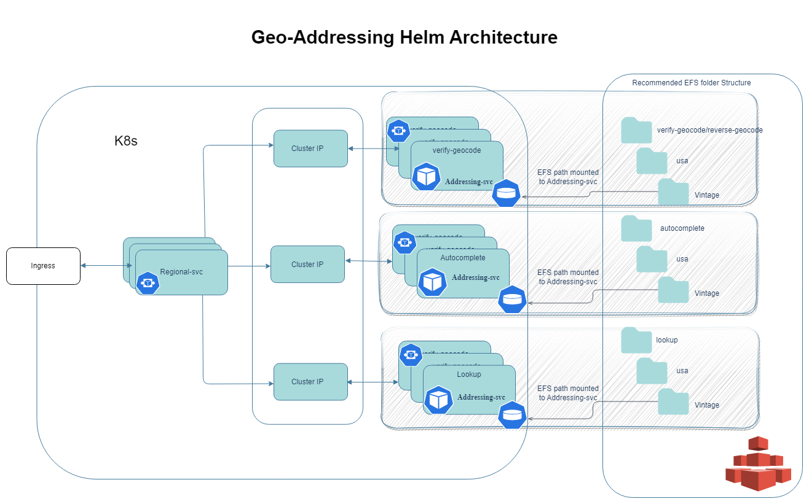

# Spatial Analytics Helm Charts

## Motivation

1. **Flexibility of deployment:**
    Spatial services are delivered as separate microservices in multiple Kubernetes pods using container-based delivery. Containers are orchestrated by Kubernetes with efficient distribution of workloads across a cluster of computers.

2. **Elastic scaling and clusterings:**
    Scale according to use cases (for example environments can scale up for overnight tile caching, scale up to meet application usage during the day). Autoscaling or manual scaling via command line or K8s dashboard. Major APIs such as Mapping, Tiling and Feature services can be separately scaled to match requirements.

3. **High availability:**
    Kubernetes handles pod health checks and ensures cluster is resilient for mission critical cases, providing auto failover. K8s monitoring tools for health and availability and server resource usage.

4. **Automatic rollbacks & rollouts:**
    Deployed from container registry. Ease of deployment and upgrades. Kubernetes can progressively roll out updates and changes to your app or its configuration. If something goes wrong, Kubernetes can and will roll back the change. Optimised infrastructure costs: Scale for usage rather than maximum anticipated capacity. Pricing model will reflect usage, hence cost of ownership can be reduced to match actual demand.

5. **Portability:**
    Can be deployed on premise or to a cloud provider. Portability and flexibility in multi-cloud environments.

## Architecture

 Infomation About the Given Architecture Image.

### Components

- [Docker Images](.)
- [Helm Charts](.)  

## Guides

- [Reference Data Installation](.)
- [Quickstart Guide AKS](./docs/guides/docs/guides/aks/QuickStartAKS.md)
- [Quickstart Guide EKS](./docs/guides/eks/README.md)
- [Quickstart Guide GKE](./docs/guides/docs/guides/gke/QuickStartGKE.md)
- [Upgrade Guide AKS](./docs/guides/gke/UninstallGuide.md)
- [Upgrade Guide EKS](./docs/guides/gke/UninstallGuide.md)
- [Upgrade Guide GKE](./docs/guides/gke/UninstallGuide.md)
- [Uninstall Guide AKS](./docs/guides/gke/UpgradeGuide.md)
- [Uninstall Guide EKS](./docs/guides/gke/UpgradeGuide.md)
- [Uninstall Guide GKE](./docs/guides/gke/UpgradeGuide.md)

## Setup

- [Local Setup](.)
- [Kubernetes Setup](.)

> NOTE: 

## Spatial Analytics Helm Version Chart

Following is the helm version chart against spatial analytics PDX docker image version.

| Docker Image PDX Version                      | Helm Chart Version |
|-----------------------------------------------|--------------------|
| `0.4.0/2023.9/Sept 12,2023` & `5.1.488` | `0.1.0` - `0.4.0`️ |
| `0.5.0/2024.2/Feb 20,2024` & `5.1.644` | `0.5.0`️ |

> NOTE:

## Miscellaneous

- [Metrics](.)
- [Application Tracing](.)
- [Logs and Monitoring](.)
- [FAQs](./docs/faq/FAQs.md)

## References

- [Releases](https://github.com/PreciselyData/cloudnative-spatial-analytics-helm/releases)
- [Helm Values](.)
- [Environment Variables](.)
- [Memory Recommendations](.)

## Links

- [Spatial Analytics API Guide](.)
- [Helm Chart Tricks](https://helm.sh/docs/howto/charts_tips_and_tricks/)
- [Nginx Ingress Controller](https://docs.nginx.com/nginx-ingress-controller/)