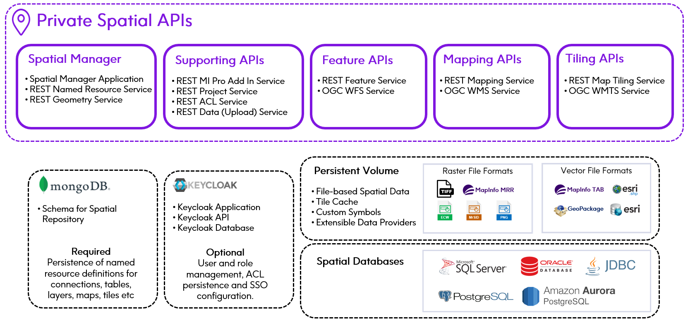

# Private Spatial APIs Helm Charts

## Motivation

1. **Flexibility of deployment**

    Spatial services are delivered as separate microservices in multiple Kubernetes pods using container-based delivery.
    Containers are orchestrated by Kubernetes with efficient distribution of workloads across a cluster of computers.

2. **Elastic scaling and clusterings**

    Scale according to use cases (for example environments can scale up for overnight tile caching, scale up to meet
    application usage during the day). Autoscaling or manual scaling via command line or K8s dashboard. Major APIs
    such as Mapping, Tiling and Feature services can be separately scaled to match requirements.

3. **High availability**

    Kubernetes handles pod health checks and ensures cluster is resilient for mission critical cases, providing
    auto failover. K8s monitoring tools for health and availability and server resource usage.

4. **Automatic rollbacks & rollouts**

    Deployed from container registry. Ease of deployment and upgrades. Kubernetes can progressively roll out updates
    and changes to your app or its configuration. If something goes wrong, Kubernetes can and will roll back the change.
    Optimised infrastructure costs: Scale for usage rather than maximum anticipated capacity. Pricing model will reflect usage,
    hence cost of ownership can be reduced to match actual demand.

5. **Portability**

    Can be deployed on premise or to a cloud provider. Portability and flexibility in multi-cloud environments.

> This solution is specifically for users who are looking for a Private REST Spatial APIs API and Kubernetes based deployments.
> [!IMPORTANT]
> Please consider these helm charts as recommendations only. They come with predefined configurations that may not be the best fit for your needs. Configurations can be tweaked based on the use case and requirements.

## Architecture
The following diagram shows an overview of Private Spatial APIs.

### Components

- [Docker Images](scripts/images-to-ecr-uploader/README.md#description)
- [Helm Charts](charts/README.md)  

## Guides

- [Quickstart Guide EKS](./docs/guides/eks/QuickStartEKS.md)
- [Upgrade Guide EKS](./docs/guides/eks/UninstallGuide.md)
- [Uninstall Guide EKS](./docs/guides/eks/UpgradeGuide.md)
- [Quickstart Guide GKE](./docs/guides/gke/QuickStartGKE.md)
- [Uninstall Guide GKE](./docs/guides/gke/UpgradeGuide.md)
- [Upgrade Guide GKE](./docs/guides/gke/UninstallGuide.md)
- [Quickstart Guide AKS](./docs/guides/aks/QuickStartAKS.md)
- [Uninstall Guide AKS](./docs/guides/gke/UpgradeGuide.md)
- [Upgrade Guide AKS](./docs/guides/aks/UninstallGuide.md)

## Private Spatial APIs Helm Version Chart

Following is the helm version chart against Private Spatial APIs PDX docker image version.

| Docker Image PDX Version     | Helm Chart Version |
|------------------------------|--------------------|
| `1.0.0/2024.0/April 30,2024` | `0.1.1`️ |

> NOTE: The docker images pushed to the image repository should be tagged with the current helm chart version.
> Refer [Downloading Private Spatial APIs Docker Images](docs/guides/eks/QuickStartEKS.md#step-3-download-docker-images) for more information.

## Miscellaneous

- [Metrics](docs/MetricsAndTraces.md#generating-insights-from-metrics)
- [Application Tracing](docs/MetricsAndTraces.md#generating-insights-from-metrics)
- [Logs and Monitoring](docs/MetricsAndTraces.md#generating-insights-from-metrics)
- [FAQs](docs/faq/FAQs.md)

## References

- [Releases](https://github.com/PreciselyData/cloudnative-spatial-analytics-helm/releases)
- [Helm Values](charts/private-spatial-apis/README.md#helm-values)
- [Environment Variables](charts/private-spatial-apis/README.md#environment-variables)
- [Memory Recommendations](charts/private-spatial-apis/README.md#memory-recommendations)

## Links

- [Private Spatial APIs API Guide](.)
- [Helm Chart Tricks](https://helm.sh/docs/howto/charts_tips_and_tricks/)
- [Nginx Ingress Controller](https://docs.nginx.com/nginx-ingress-controller/)