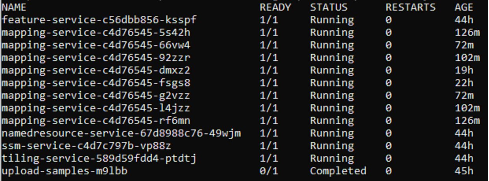

## FAQs

If you encounter any challenges or have questions during the deployment of the spatial-analytics helm chart, we recommend
checking the below questions. This resource provides answers to common questions and solutions to known issues, offering
assistance in troubleshooting any deployment-related difficulties you may encounter. If your question is not covered in
the FAQs, feel free to reach out to our support team for further assistance.

<br>
1. How can I monitor the spatial-analytics Helm Chart is installation?
   <br><br>
   Once you run the helm chart command, you can monitor the helm chart creation by using the following command:

    ```shell
    kubectl get pods -n [spatial-analytics] -w
    ```

Please wait for all the service pods to be in the running stage:  



2. How to check the logs if the helm chart installation is unsuccessful?
   <br><br>
   In case of failure during helm chart installation, you can view the status of the pods by using the following
   command:

   ```shell
   kubectl get pods -n [spatial-analytics]
   ```
   For each failed pod, you can check the logs or describe the pods for viewing the failure events with the following
   command:

   ```shell
   kubectl logs -f [pod-name] -n [spatial-analytics]
   kubectl describe pod [pod-name] -n [spatial-analytics]
   ```

   The spatial-analytics helm chart runs a job to copy sample data, in that case, you might also want to check the failed jobs using
   following command:
   ```shell
   kubectl get jobs -n [spatial-analytics]
   ```
   You can view the logs or describe the job for failure events using following command:
   ```shell
   kubectl logs -f [upload-samples-pod-name] -n [spatial-analytics]
   kubectl describe job upload-samples -n [spatial-analytics]
   ```
3. How to clean up the resources if the helm-chart installation is unsuccessful?
   <br><br>
   Helm chart installation may fail if mandatory parameters are not specified. Apart from mandatory parameters, you can always override the default values in
   the [values.yaml](../../charts/spatial-cloud-native/values.yaml) file by using the --set parameter.

   However, you can view the logs and fix those issues by cleaning up and rerunning the helm command.  
   
    ```shell
    kubectl describe pod [pod-name] -n [spatial-analytics]
    kubectl logs [pod-name] -n [spatial-analytics]
    ```

   To clean up the resources, use the following commands:
    ```shell
    helm uninstall spatial-analytics -n [spatial-analytics]
    kubectl delete pvc data-volume-claim -n [spatial-analytics]
    ```

[🔗 Return to `Table of Contents` 🔗](../../README.md#miscellaneous)