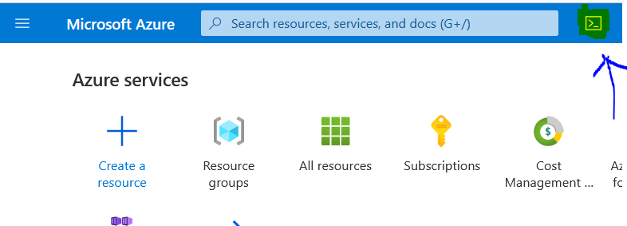
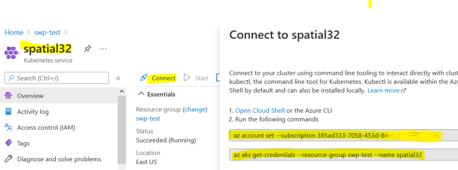
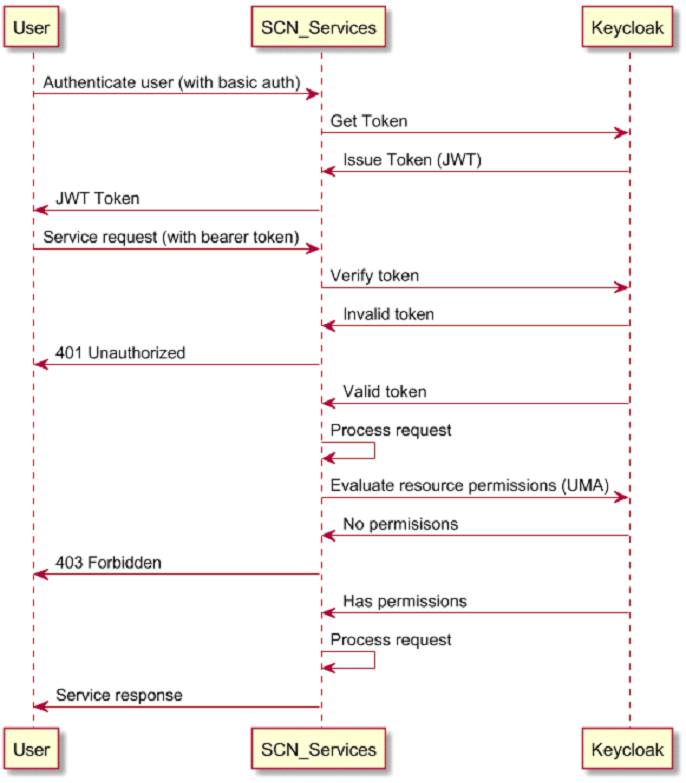

# Installing Private Spatial APIs Helm Chart on Azure AKS

## **Before starting**

Make sure you have the following items before starting:
- Access tokens to Docker image registry.
- A subscription that can be used to create Storage account, K8 cluster, file share. 

It is recommended to use a single Azure subscription to complete this tutorial. To make it easier, this tutorial is based on Azure portal and
Azure Cloud Shell (Bash). In order to achieve the best performance, create all resources in the same region.

## Preview
- [Step 1: Prepare your environment](#step-1-prepare-your-environment)
- [Step 2: Create a AKS Cluster ](#step-2-create-k8s-cluster-aks)
- [Step 3: Download Private Spatial APIs Docker Images](#step-3-download-private-spatial-apis-docker-images)
- [Step 4: Create a Persistent Volume](#step-4-create-a-persistent-volume)
- [Step 5: Prepare a database for repository](#step-5-prepare-a-database-for-repository)
- [Step 6: Installation of Private Spatial APIs Helm Chart](#step-6-installation-of-private-spatial-apis-helm-chart)
- [Step 7: Enabling security - AuthN/AuthZ (Optional)](#step-7-enabling-security---authnauthz-optional)
- [Step 8: Use Spatial Utilities](#step-8-use-spatial-utilities)

## Step 1: Prepare your environment
To deploy Private Spatial APIs application in Azure AKS, install the following client tools on you machine:
- [Docker](https://docs.docker.com/engine/install/)
- [Azure CLI](https://learn.microsoft.com/en-us/cli/azure/)

Above tools are required to push docker images to Azure Container Registry.

### Setup Cloud Shell
Login to [Microsoft Azure Portal](https://portal.azure.com/)
\
Open Cloud Shell by clicking on the icon on the toolbar.
\
Verify the following utilities,
```
az version 
```
```
kubectl version 
```
```
helm version 
```


### Clone Private Spatial APIs helm charts & resources
```
git clone https://github.com/PreciselyData/Private-Spatial-APIs
```

## Step 2: Create K8s Cluster (AKS)

You can create an AKS cluster or use an existing EKS cluster.
-   [2.1 Create an AKS Cluster](#21-create-an-aks-cluster-)
-   [2.2 Connect to AKS Cluster](#22-connect-to-aks-cluster)
-   [2.3 Install Ingress-NGINX controller](#23-install-ingress-nginx-controller)

Also see:    
[Deploy an Azure Kubernetes Service (AKS) cluster using Azure portal](https://docs.microsoft.com/en-us/azure/aks/kubernetes-walkthrough-portal)  
[Create an unmanaged ingress controller](https://docs.microsoft.com/en-us/azure/aks/ingress-basic)  
[AKS ingress](https://github.com/MicrosoftDocs/azure-docs/blob/main/articles/aks/ingress-basic.md)

### 2.1 Create an AKS Cluster 
Default Private Spatial APIs deployment will need 30 vCPUs + 15GB RAM.
It is good to start from a single node AKS cluster with `F32s_v2` VM. It
has 32 vCPUs + 64GB RAM.

In Azure portal, click on **Kubernetes services** 


Now click on **Create** → **Create a Kubernetes Cluster** 


#### Specify information for cluster


Create a new Resource group `spatial-aks` for this AKS cluster

Kubernetes cluster name -> `spatial32`\
Kubernetes version -> `1.31.2`\
Node size -> Change size -> F32s_v2\
Scale method -> `Manual`\
Node count -> `1`

> NOTE: Create tag if you want to manage resource usage by application tag

Click on **Create the AKS cluster** (It may take some time to get provisioned).

### 2.2 Connect to AKS Cluster

We use Azure Cloud Shell (VM) as a bridge to manage the cluster and move data to the Fileshares. Alternatively, you can use [Azure CLI](https://learn.microsoft.com/en-us/cli/azure/install-azure-cli) on your machine.
\
At the home page of Azure portal, click on the Azure Cloud Shell icon (next to the search field), following the instructions to enable the Bash (you may need to create a storage Fileshares if you are first time using the Cloud Shell).
#### Open Cloud Shell


>NOTE: in the Bash windows, you can use ctrl-c to copy and shift-insert
to paste.


#### Set kubectl context to AKS cluster
In Azure portal, go to

spatial-aks → spatial32,and click on `Connect` to find the commands to add the context to kubectl.


>Note: ``az`` command is bound to a subscription, if the resource group is
not in the current subscription, then need to switch.

Clicking on `Open Cloud Shell` will also run the both az commands automatically and reset the cloud
shell if it was already open


```shell
az account set --subscription 385ad333-7058-453d-846b-xxxxxxxxx
```

```shell
az aks get-credentials --resource-group spatial-aks --name spatial32
```

```shell
kubectl config use-context spatial32
kubectl config current-context

````
Now kubectl is set default to the AKS spatial32 cluster. You can check
the status of the nodes
```shell
kubectl get nodes
```
```shell
NAME                                STATUS   ROLES   AGE    VERSION
aks-agentpool-39271417-vmss000000   Ready    <none>  106s   v1.31.2
```

###  2.3 Install Ingress-NGINX controller
> Note: If you would like to setup TLS for HTTPS traffic follow official azure docs: https://docs.microsoft.com/en-us/azure/aks/ingress-tls?tabs=azure-cli

The Private Spatial APIs services requires ingress controller setup. Run the following command in Cloud Shell for setting up NGINX ingress controller:
  ```shell
helm repo add ingress-nginx https://kubernetes.github.io/ingress-nginx
helm repo update

helm install ingress-nginx ingress-nginx/ingress-nginx \
  --create-namespace \
  --namespace ingress-nginx \
  --set controller.service.annotations."service\.beta\.kubernetes\.io/azure-load-balancer-health-probe-request-path"=/healthz \
  --set controller.service.externalTrafficPolicy=Local
  ```
  
  Once ingress controller setup is completed, you can verify the status and get the ingress URL by using the following command:
  ```shell
  kubectl get svc -n ingress-nginx  
  ```
```shell
NAME                                 TYPE           CLUSTER-IP     EXTERNAL-IP    PORT(S)                      AGE
ingress-nginx-controller             LoadBalancer   10.0.5.175     23.96.127.58   80:31943/TCP,443:32142/TCP   45h
ingress-nginx-controller-admission   ClusterIP      10.0.134.147   <none>         443/TCP                      45h
```

> Make a note of `EXTERNAL-IP=23.96.127.58`, it will be used for later steps.

## Step 3: Download Private Spatial APIs Docker Images

The docker files can be downloaded from either Precisely's Data Portfolio or [Data Integrity Suite](https://cloud.precisely.com/). For information about Precisely's Data Portfolio,
see the [Precisely Data Guide](https://dataguide.precisely.com/) where you can also sign up for a free account and
access software, reference data and docker files available in [Precisely Data Experience](https://data.precisely.com/).

After download, the docker images need to be pushed to a container registry. You can create Azure Container Registry by following [these](https://learn.microsoft.com/en-us/azure/container-registry/container-registry-get-started-portal?tabs=azure-) steps if you don't have one. Then you can use a script [push-images](../../../scripts/aks/push-images.sh) to push the docker images to container registry.

>Note: Azure Cloud Shell doesn't support docker daemon required by the script, so you have to install **[Docker](https://docs.docker.com/engine/install/)** and **[Azure CLI](https://learn.microsoft.com/en-us/cli/azure/get-started-with-azure-cli)** on your local system.  

Open a shell on you local system and execute the following steps.

Log in to your Azure Container Registry:
```shell
az login
az acr login --name <azure_container_registry>
```

> Note: Unzip the downloaded docker images to a directory <spatial_analytics_docker_images_dir> so that it contains tar files.

Run the shell script to push images to Azure Container Registry:
```shell
cd <spatial_analytics_docker_images_dir>
chmod a+x ~/Private-Spatial-APIs/scripts/aks/push-images.sh
~/Private-Spatial-APIs/scripts/aks/push-images.sh <azure_container_registry>.azurecr.io
```
You can also load images one by one if there's no enough disk space available
```shell
~/Private-Spatial-APIs/scripts/aks/push-images.sh <azure_container_registry>.azurecr.io  <tar file name without ext>
```
List images in the registry:
\
``az acr repository list --name <azure_container_registry> --output table``

There are six docker images which will be pushed to container registry:
1. feature-service
2. mapping-service
3. tiling-service
4. namedresource-service
5. spatialmanager-service
6. samples-data

## Step 4: Create a Persistent Volume
A PV (Persistent Volume) is required to share files across all services (pods), including
- File based Spatial data sets, such as Mapinfo TAB, Shape, GeoPackage and Geodatabase etc.
- Tile cache
- Map image cache
- Custom Symbols
- Extended DataProviders
- JDBC drivers

This spatial data should be deployed using a [persistent volume](https://kubernetes.io/docs/concepts/storage/persistent-volumes/).
The persistent volume is backed by Azure File share so that the data is ready to use immediately when the
volume is mounted to the pods.
\
\
By default, Azure File shares use SMB protocol that doesn't perform
well with Private Spatial APIs deployment. We recommend the NFS protocol.
Also, see:\
[https://docs.microsoft.com/en-us/azure/aks/azure-files-volume](https://docs.microsoft.com/en-us/azure/cloud-shell/overview)\
[https://docs.microsoft.com/en-us/azure/vs-azure-tools-storage-explorer-files](https://docs.microsoft.com/en-us/azure/vs-azure-tools-storage-explorer-files)\
[https://docs.microsoft.com/en-us/azure/storage/files/storage-files-scale-targets](https://helm.sh/docs/chart_template_guide/values_files/)\
[https://docs.microsoft.com/en-us/azure/storage/files/storage-troubleshooting-files-performance](https://docs.microsoft.com/en-us/azure/storage/files/storage-troubleshooting-files-performance)

###  4.1 Register the NFS feature to Subscription ID
To use the NFS Fileshares, the feature needs to be registered to your
Subscription ID first.

```shell
az feature register --name AllowNfsFileShares --namespace Microsoft.Storage --subscription 78f8b96e-f0bf-47a9-81b6-xxxxxx
```
\
\
It may take an hour to get approved. Check and wait until the state
becomes "**Registered**",

```shell
az feature show --name AllowNfsFileShares --namespace Microsoft.Storage --subscription 78f8b96e-f0bf-47a9-81b6 xxxxxx
```

```shell
{
"id": "/subscriptions/78f8b96e-f0bf-47a9-81b6-xxxxxx/providers/Microsoft.Features/providers/Microsoft.Storage/features/AllowNfsFileShares",
"name": "Microsoft.Storage/AllowNfsFileShares",
"properties": {
"state": " Registered"
},
"type": "Microsoft.Features/providers/features"
}
```
Once the feature 'AllowNfsFileShares' is registered, invoking 'az provider register -n Microsoft.Storage' is required to get the change propagated
```
az provider register -n Microsoft.Storage
```

### 4.2 Create a Storage Account for Fileshares

Click on [Azure Portal Home](https://portal.azure.com/#home) -> **Storage Accounts**


Storage Account → Create\
Resource group → Create new → `spatial-fileshares`\
Storage account name → `spatialstorage001`\
Select performance → `Premium`\
Select Premium account type → `File shares`

Advanced → Security → Require secure transfer for REST API operations
to allow HTTP → `Uncheck`\
Click -> `Review + Create`\
Click -> `Create`

###  4.3 Configure virtual network

In Azure portal, go to spatial-fileshares → spatialstorage001, select
Networking,\


Add existing virtual network from the resource group of spatial32 AKS
cluster, so AKS cluster can access the NFS Fileshares.


And select the subnets, Enable..., Add...\
Save ...

##  4.4 Create a Fileshare

In Azure portal, go to

Home -> Resource Group -> spatial-fileshares ->
spatialstorage001 -> File shares


Add a Fileshares\
Give a name `fileshares`

Specify Provisioned capacity to 100GB (The size defines the cost and
performance, check out the number of Maximum IO/s below it). The
capacity can be enlarged after creation. Select the NFS protocol

Create the Fileshares.

#### 4.5 Create PersistentVolume (PV) and PersistentVolumeClaim (PVC)
In Cloud Shell, clone Private Spatial APIs repository.
```shell
git clone https://github.com/PreciselyData/Private-Spatial-APIs.git
```
```shell
cd SpatialAnalytics/deploy/azure-aks
```

##### Create PV from the Fileshares
If you used different names of resource group and storage account, find
out the actual NFS server name and path as below and update the template
before creating PV, otherwise, you can skip the following part.\
In Azure portal, go to the

spatialstorage001 → Fileshares → fileshares

###### Find connection server info for fileshares


After clicking on `Connect from Linux` it should display with information that can be used to mount Fileshares.
we need server information so we can update `fileshare-pv.yaml`.


In Cloud Shell, update the server and path in fileshare-pv.yaml if needed.

**fileshare-pv.yaml**

```yaml
apiVersion: v1
kind: PersistentVolume
metadata:
  name: data-volume
  labels:
    app: spatial
spec:
  capacity:
    storage: 100Gi
  volumeMode: Filesystem
  accessModes:
    - ReadWriteMany
  storageClassName: ""
  mountOptions:
    - hard
  nfs: #update server name and or path as needed based on storage creation
    server: spatialstorage001.file.core.windows.net
    path: /spatialstorage001/fileshares
```
Create the PV from the template file.

```shell
kubectl apply -f ~/Private-Spatial-APIs/deploy/aks/fileshare-pv.yaml 
```

To verify

```shell
kubectl get pv
```

```shell
NAME          CAPACITY   ACCESS MODES   RECLAIM POLICY   STATUS      CLAIM   STORAGECLASS   REASON   AGE
data-volume   100Gi      RWX            Retain           Available                                   13s
```

### Create PVC from the Fileshares PV

In Cloud Shell, create the PVC from the template file **fileshare-pvc.yaml**

```shell
kubectl create namespace spatial-analytics
kubectl apply -f ~/Private-Spatial-APIs/deploy/aks/fileshare-pvc.yaml -n spatial-analytics 
```

To verify
```shell
kubectl get pvc -n spatial-analytics
```
```shell
NAME                STATUS   VOLUME        CAPACITY   ACCESS MODES   STORAGECLASS   AGE
data-volume-claim   Bound    data-volume   100Gi      RWX                           15s
```
Make sure the PVC is bound to the PV successfully.


## Step 5: Prepare a database for repository
> NOTE: if you only need Feature service, you may skip step 5,6 see [Feature only deployment](../../guides/feature-only-deployment.md).

A MongoDB replica set is used to persistent repository content.

For a production deployment, a multi-node MongoDB replica set is recommended. Here is the link to [Install MongoDB](https://www.mongodb.com/docs/manual/installation/).
\
If you have a MongoDB replica set that can be accessed from inside the Kubernetes cluster, then collect the connection uri for further service config.

If you don't have a MongoDB replica set currently, for your convenience, you can deploy a single node MongoDB replica set for testing as below, otherwise, go to the next step.

### Install a MongoDB instance by helm for testing

Install MongoDB from helm chart
```
helm install mongo ~/Private-Spatial-APIs/charts/mongo-standalone -n mongo --create-namespace
```
```
kubectl get pod -n mongo
```
Wait until the mongo pod is ready
```
NAME                                      READY   STATUS    RESTARTS   AGE
mongo-XXXXXXXXXX-XXXX                     1/1     Running   0          8m35s
```
This will install a single node replica set instance without authentication
```
connection uri = mongodb://mongo-svc.mongo.svc.cluster.local/spatial-repository?authSource=admin&ssl=false
```
## Step 6: Installation of Private Spatial APIs Helm Chart

> NOTE: For every helm chart version update, make sure you run the [Step 3](#step-3-download-private-spatial-apis-docker-images) for uploading the docker images with the newest tag.

There are two deployment files to choose from that require different amount of resources (CPU and Memory). Use `deploy/gitlab-deployment-small-values.yaml` for trying out the APIs. A production deployment should use `Private-Spatial-APIs/deploy/gitlab-deployment-values.yaml`.

Create a secret for pulling image from ACR:
\
Following command gets a token for current user to authenticate against ACR, if you want to use a service principal credentials, refer to [Use Service principal](https://learn.microsoft.com/en-us/azure/container-registry/container-registry-auth-kubernetes).
```shell
kubectl create secret docker-registry regcred \
    --namespace spatial-analytics \
    --docker-server=[acr_name].azurecr.io \
    --docker-username=00000000-0000-0000-0000-000000000000\
    --docker-password=$(az acr login --name [acr_name] --expose-token --output tsv --query accessToken)
```
To install/upgrade the Private Spatial APIs helm chart, use the following command:

```shell
cd ~/Private-Spatial-APIs/

helm install spatial-analytics ~/Private-Spatial-APIs/charts/private-spatial-apis \
 -f ~/Private-Spatial-APIs/deploy/gitlab-deployment-values.yaml \
 --set "global.ingress.host=[ingress-host-name]" \
 --set "repository.mongodb.url=[mongodb-url]" \ 
 --set "global.registry.url=[acr].azurecr.io" \
 --set "global.registry.tag=latest" \ 
 --set "global.registry.secrets=regcred" \  
 --namespace spatial-analytics   
```

> Note: For a production environment, you should create a DNS record for ingress loadbalancer IP and use a domain name for `global.ingress.host`. 
> You can skip specifying the `global.ingress.host` parameter altogether to install the chart successfully but that is not recommended for production.   

This should install Private Spatial APIs and set up a sample dataset that can be used to play around with the product.

> Also, for more information, refer to the comments in [values.yaml](../../../charts/private-spatial-apis/values.yaml)
#### Mandatory Parameters
* ``global.ingress.host``: The Host name of Ingress e.g. http://aab329b2d767544.us-east-1.elb.amazonaws.com
* ``repository.mongodb.url``: The Mongo DB connection URI e.g. mongodb+srv://<username>:<password>@mongo-svc.mongo.svc.cluster.local/spatial-repository?authSource=admin&ssl=false
* ``global.registry.url``: The ACR repository for Private Spatial APIs docker image e.g. spatialregistry.azurecr.io
* ``global.registry.tag``: The docker image tag value e.g. 1.1.3 or latest.
* ``global.registry.secrets``: The name of the secret holding Azure Container Registry (ACR)  credential information.

For more information on helm values, follow [this link](../../../charts/private-spatial-apis/README.md#helm-values).

> NOTE: In case Helm chart deployment is not possible, check [here](../../guides/helm-template.md) for Kubernetes manifest deployment. 

Once you run Private Spatial APIs helm install/upgrade command, it might take few minutes to get ready for the first time. You can run the following command to check the creation of pods. Please wait until all the pods are in running state:
```shell
kubectl get pods -w --namespace spatial-analytics 
```

When all the pods are up, you can run the following command to check the ingress service host:
```shell
kubectl get services -o wide  nginx-ingress-ingress-nginx-controller
```


After all the pods in namespace 'spatial-analytics' are in 'ready' status, launch SpatialServerManager in a browser with the URL below (You may need to accept the default self-signed certificate from Ingress. Check out the ingress document on how to change the certificate if you need). By default, the security is off, so you can login with any username/password. You should be able to browser named resources and pre-view maps. The link to Spatial Manager: `https://<your external ip>/SpatialServerManager`


You can check HPA status while services are running
```
kubectl get hpa mapping-service
```

If you are using the OGC services please refer to the on-premise docs ([WFS](https://docs.precisely.com/docs/sftw/spectrum/24.1/en/webhelp/Spatial/Spatial/source/Resources/resources/repoman/wfs_settings.html), [WMS](https://docs.precisely.com/docs/sftw/spectrum/24.1/en/webhelp/Spatial/Spatial/source/Resources/resources/repoman/wms_settings.html), [WMTS](https://docs.precisely.com/docs/sftw/spectrum/24.1/en/webhelp/Spatial/Spatial/source/Resources/resources/repoman/wmts_settings.html)) to configure the Online resource / Service URL with the public access url (Ingress EXTERNAL-IP).

## Step 7: Enabling security - AuthN/AuthZ (Optional)
A `Keycloak` (18.0.0+) is used for authentication and authorization.
- Authenticate a user
- Issue JWT token for an authenticated user
- Verify the JWT token used in a service request
- Resource based authorization
- Manage users(realm)/roles(client)
- Federate with other IDPs

General service flow,




Keycloak should have KC_HTTP_RELATIVE_PATH and KC_HOSTNAME_PATH set to ‘/auth’. Private Spatial APIs is compatible with Keycloak version 18.0.0 ~ 24.0.1. For a production deployment, a multi-node Keycloak cluster is recommended. Here is a link to [Keycloak Install](https://www.keycloak.org/operator/installation), [Keycloak User Guides](https://www.keycloak.org/guides)

If you have a Keycloak instance that can be accessed from inside the Kubernetes cluster, then collect the issuer url for further service config.

If you don't have a Keycloak instance available currently, for your convenience, you can deploy a Keycloak for testing by following the first step below, otherwise, you can skip the step.


### Deploy Keycloak by helm chart for testing

Identify the external loadbalancer host to expose the Keycloak Management Console UI
```
kubectl get svc -n ingress-nginx
```
looking for the EXTERNAL-IP in the output for the value of `hostname` used in the next command.

```
helm install keycloak ~/Private-Spatial-APIs/charts/keycloak-standalone -n keycloak --create-namespace --set hostname=<ingress_host_name > 
```
> Note: For a production environment, you should create a DNS record for ingress loadbalancer IP and use the domain name for `hostname`.
> You can skip specifying the `hostname` parameter altogether to install the chart successfully but that is not recommended for production.


Wait until `keycloak` pod is up and ready (`kubectl get pod -n keycloak`). It may take some time for Ingress to be deployed.

Open a browser and login to keycloak console with the admin credentials (default to admin/admin) at
`http://<ingress external ip>/auth`

> NOTE: this keycloak server is running in DEV mode, only use HTTP to login to admin-console.

### Create a realm for spatial services

Private Spatial APIs has a realm template (realm-spatial.json) that helps to setup the required realm configuration and spatial client settings. Private Spatial APIs authenticate with realm users and authorize with spatial client roles and resource permissions. All resource permissions (ACLs) are managed in spatial client through UMA API.

Download `Private-Spatial-APIs/deploy/realm-spatial.json` to your local system.
In the administration console, click on realm pulldown menu and select `Create realm`

Click on `Browse...` button, select the realm file `realm-spatial.json`, give a name to the new realm (use all lowercase name, e.g. `development`) and click the `Create` (do not double clicks).

After imported the realm from the template, use Keycloak Admin console to change admin credentials, default user credentials and spatial client secret.

Keycloak Admin console is used to manage users in realm and roles in spatial client. Private Spatial APIs do not use realm roles.

also see Keycloak document about the [Management Console](https://www.keycloak.org/docs/latest/server_admin/)


### Update service config to use your realm in the keycloak
```
kubectl edit cm spatial-config -n spatial-analytics
```
Update the following properties with the values below,
```
...
oauth2.enabled: "true"
oauth2.issuer-uri: "http://<ingress external ip>/auth/realms/<your realm name>"
oauth2.client-id: "spatial"
oauth2.client-secret: "fd17bc1d-cefc-41a3-8c50-bb545736caa6"
spring.security.oauth2.resourceserver.jwt.issuer-uri: "<http://<ingress external ip>/auth/realms/<your realm name>"
...
```
> NOTE: the property `oauth2.required-authority` restricts service access to the users who have at least the ’user’ client role by default. It can be configured to any spatial client roles. A value "" will disable the restriction.

Restart all services to pick up the configuration changes
```
kubectl rollout restart deployment -n spatial-analytics
```
Wait for all pods are ready
```
kubectl get pod -n spatial-analytics --watch
```

Login to Spatial Manager when all services are ready. Initial password for `admin` is `Spatialadmin0`

`https://<your external ip>/SpatialServerManager`

Verify if you can preview a map in Spatial Manager.

Please follow the user guide for how to apply permissions and other security related topics.

### IDP Federation
Keycloak Federation allows you to authenticate users from your own IDP (such as LDAP) and map user roles to spatial client roles for authorization. Referring to Keycloak documents for the details.

also see [IDP integration](../../guides/IDP-integration.md)

## Step 8: Use Spatial Utilities
There are various utilities for:
- Generating MapTiling requests
- Generating Map tiles for the WMTS service
- Uploading maps from MapInfo Pro to the Spatial repository
- Importing and exporting Spatial repository.

More details on Spatial Utilities can be found [here](../../guides/spatial-utilities.md).

## Next Sections
- [Private Spatial APIs Usage](../../../charts/private-spatial-apis/README.md)
- [Metrics](../../Metrics.md#generating-insights-from-metrics)
- [FAQs](../../faq/FAQs.md)


[🔗 Return to `Table of Contents` 🔗](../../../README.md#guides)
