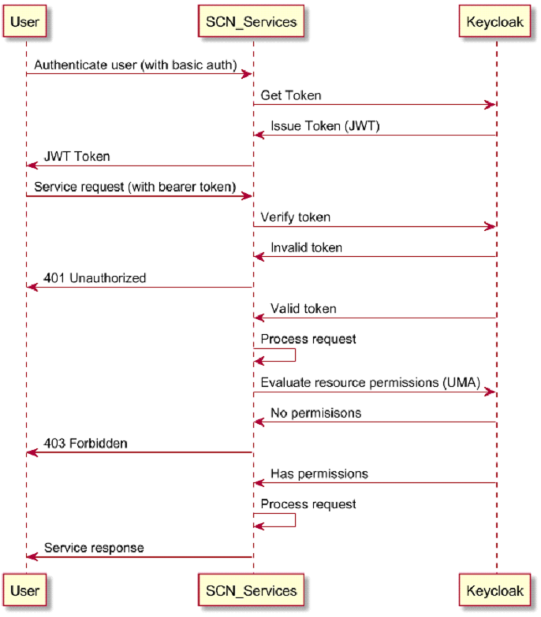

# Installing Private Spatial APIs Helm Chart on AWS EKS

### Before starting
Make sure you have an AWS account with following permissions:  
  - create IAM roles  
  - create IAM policies  
  - create EKS clusters (EC2 based)  
  - create EFS filesystem  
  
## Step 1: Prepare your environment
To deploy Private Spatial APIs application in AWS EKS, install the following client tools:

- [kubectl](https://kubernetes.io/docs/tasks/tools/install-kubectl/)
- [helm3](https://helm.sh/docs/intro/install/)

##### Amazon Elastic Kubernetes Service (EKS)

- [aws-cli](https://docs.aws.amazon.com/cli/latest/userguide/cli-chap-install.html)
- [eksctl](https://docs.aws.amazon.com/eks/latest/userguide/getting-started-eksctl.html)


### Clone Private Spatial APIs helm charts & resources
```
git clone https://github.com/PreciselyData/Private-Spatial-APIs
```

## Step 2: Create K8s Cluster (EKS)

You can create the EKS cluster or use an existing EKS cluster.

- If you DON'T have a EKS cluster, we have provided you with a
  sample [cluster installation script](../../../cluster-sample/create-eks-cluster.yaml). Run the following command from
  parent directory to create the cluster using the script:
    ```shell
    eksctl create cluster -f ./cluster-sample/create-eks-cluster.yaml
    ```

- If you already have an EKS cluster, make sure you have following addons or plugins related to it, installed on the
  cluster:
    ```yaml
    addons:
    - name: vpc-cni
    - name: coredns
    - name: kube-proxy
    - name: aws-efs-csi-driver
    ```
  Run the following command to install addons only:
    ```shell
    aws eks --region [aws-region] update-kubeconfig --name [cluster-name]
    
    eksctl create addon -f ./cluster-sample/create-eks-cluster.yaml
    ```
- Once you create EKS cluster, you can
  apply [Cluster Autoscaler](https://github.com/kubernetes/autoscaler/tree/master/cluster-autoscaler) so that the
  cluster can be scaled vertically as per requirements. We have provided a sample cluster autoscaler script. Please run
  the following command to create cluster autoscaler:
    ```shell
    kubectl apply -f ./cluster-sample/cluster-auto-scaler.yaml
    ```
- To enable [HorizontalPodAutoscaling](https://kubernetes.io/docs/tasks/run-application/horizontal-pod-autoscale/), the
  cluster also needs a [Metrics API Server](https://github.com/kubernetes-sigs/metrics-server) for capturing cluster
  metrics. Run the following command for installing Metrics API Server:
    ```shell
    kubectl apply -f https://github.com/kubernetes-sigs/metrics-server/releases/latest/download/components.yaml
    ```
- The Private Spatial APIs service requires ingress controller setup. Run the following command for setting up NGINX ingress controller:
  ```shell
  helm repo add ingress-nginx https://kubernetes.github.io/ingress-nginx
  helm install nginx-ingress ingress-nginx/ingress-nginx -f ./cluster-sample/ingress-values.yaml
  ```
  *Note: You can update the nodeSelector according to your cluster's ingress node.*

  Once ingress controller setup is completed, you can verify the status and get the ingress URL by using the following command:
  ```shell
  kubectl get services -o wide -w nginx-ingress-ingress-nginx-controller    
  ```

EKS cluster must have the above addons and ingress for the ease of installation of Private Spatial APIs Helm Chart.


> Note: You should run this command in your shell to connect to EKS cluster:  
> `` aws eks --region [aws-region] update-kubeconfig --name [cluster-name] ``  
> This will update your local copy of EKS cluster configuration. 

## Step 3: Download Private Spatial APIs Docker Images

The docker files can be downloaded from Precisely's Data Portfolio. For information about Precisely's Data Portfolio,
see the [Precisely Data Guide](https://dataguide.precisely.com/) where you can also sign up for a free account and
access software, reference data and docker files available in [Precisely Data Experience](https://data.precisely.com/).

The Private Spatial APIs docker images need to be present in the ECR. If you haven't pushed the required docker
images to ECR, then you can use a sample script [upload_ecr.py](../../../scripts/images-to-ecr-uploader) to download the docker images
from [Precisely Data Experience](https://data.precisely.com/)
and push it to your Elastic Container Registry.

>Note: This script requires python, docker and AWS CLI to be installed in your system. Also make sure that AWS CLI is configured before you run the script. Run this command - ``aws sts get-caller-identity``

>Note: Ensure that the value of `image_tag` in script [upload_ecr.py](../../../scripts/images-to-ecr-uploader) is set to the current docker image release version before you run the script.  

```shell
cd ./scripts/images-to-ecr-uploader
pip install -r requirements.txt
python upload_ecr.py --pdx-api-key [pdx-api-key] --pdx-api-secret [pdx-secret] --aws-region [aws-region]
```

There are six docker images which will be pushed to ECR with the tag of helm chart version.
1. feature-service
2. mapping-service
3. tiling-service
4. namedresource-service
5. spatialmanager-service
6. samples-data

For more details related to docker images download script, follow the instructions [here](../../../scripts/images-to-ecr-uploader/README.md)

## Step 4: Create a Persistent Volume
A PV (Persistent Volume) is required to share files across all services (pods), including
- File based Spatial data sets, such as Mapinfo TAB, Shape, GeoPackage and Geodatabase etc.
- Tile cache
- Map image cache
- Custom Symbols
- Extended DataProviders
- JDBC drivers  

This spatial data should be deployed using a [persistent volume](https://kubernetes.io/docs/concepts/storage/persistent-volumes/).
The persistent volume is backed by Amazon Elastic File System (EFS) so that the data is ready to use immediately when the
volume is mounted to the pods.

If you don't have an existing File System, you can create one using given sample. We have provided a python script
to create EFS and link it to EKS cluster, or directly link existing EFS to the EKS cluster by creating mount targets.

**NOTE: If you already have created mount targets for the EFS to EKS cluster, skip this step.**

- If you DON'T have existing EFS, run the following commands:
  ```shell
  cd ./scripts/efs-creator
  pip install -r requirements.txt
  python ./create_efs.py --cluster-name [eks-cluster-name] --aws-access-key [aws-access-key] --aws-secret [aws-secret] --aws-region [aws-region] --efs-name [precisely-spatial-analytics-efs] --security-group-name [precisely-spatial-analytics-sg]
  ```

- If you already have EFS, but you want to create mount targets so that EFS can be accessed from the EKS cluster, run the following command:
  ```shell
  cd ../scripts/efs-creator
  pip install -r requirements.txt
  python ./create_efs.py --cluster-name [eks-cluster-name] --existing true --aws-access-key [aws-access-key] --aws-secret [aws-secret-key] --aws-region [aws-region] --file-system-id [file-system-id]
  ```
Make a note of `FileSystemId` displayed on you screen.  

#### Create a StorageClass for EFS Driver  
Update template [efs-sc.yaml](../../../deploy/eks/efs-sc.yaml) with the file system id of your EFS file system & run:  

```kubectl apply -f ./deploy/eks/efs-sc.yaml ```  

You can check the result by executing:    
```kubectl get sc```  

#### Create a PVC  
We will deploy Private Spatial APIs into a new namespace 'spatial-analytics', so create a namespace first,  
```kubectl create ns spatial-analytics```

Create a PVC in the namespace that dynamically provisioning a PV using efs-sc storage class,  

```kubectl apply -f ./deploy/eks/efs-pvc.yaml -n spatial-analytics```  

Check results, wait until the pvc status becomes Bound.  
```kubectl get pvc -n spatial-analytics```

## Step 5: Prepare a database for repository
A MongoDB replica set is used to persistent repository content.

For a production deployment, a multi-node MongoDB replica set is recommended. Here is the link to [Install MongoDB](https://www.mongodb.com/docs/manual/installation/).


If you have a MongoDB replica set that can be accessed from inside the Kubernetes cluster, then collect the connection uri for further service config.

If you don't have a MongoDB replica set currently, for your convenience, you can deploy a single node MongoDB replica set for testing as below, otherwise, go to the next step.

### Install a MongoDB instance by helm for testing

Install MongoDB from helm chart
```
helm install mongo ./charts/mongo-standalone -n mongo --create-namespace
```
```
kubectl get pod -n mongo
```
Wait until the mongo pod is ready
```
NAME                                      READY   STATUS    RESTARTS   AGE
mongo-XXXXXXXXXX-XXXX                     1/1     Running   0          8m35s
```
This will install a single node replica set instance without authentication
```
connection uri = mongodb://mongo-svc.mongo.svc.cluster.local/spatial-repository?authSource=admin&ssl=false
```
## Step 6: Installation of Private Spatial APIs Helm Chart

> NOTE: For every helm chart version update, make sure you run the [Step 3](#step-3-download-private-spatial-apis-docker-images) for uploading the docker images with the newest tag.

There are two deployment files to choose from that require different amount of resources (CPU and Memory). Use `deploy/gitlab-deployment-small-values.yaml` for trying out the APIs. A production deployment should use `Private-Spatial-APIs/deploy/gitlab-deployment-values.yaml`.

Create a secret for pulling image from ECR repository  
```shell
kubectl create secret docker-registry regcred --docker-server=[account_id].dkr.ecr.[aws_region].amazonaws.com   --docker-username=AWS   --docker-password=$(aws ecr get-login-password --region [aws-reqion]) --namespace=spatial-analytics
```
To install/upgrade the Private Spatial APIs helm chart, use the following command:

```shell
helm install spatial-analytics ./charts/private-spatial-apis \
 -f ./deploy/gitlab-deployment-values.yaml \
 --set "global.ingress.host=[ingress-host-name]" \
 --set "repository.mongodb.url=[mongodb-url]" \ 
 --set "global.registry.url=[aws-account-id].dkr.ecr.[aws-region].amazonaws.com" \
 --set "global.registry.tag=1.1.1" \ 
 --set "global.registry.secrets=regcred" \ 
  --namespace spatial-analytics   
```

This should install Private Spatial APIs and set up a sample dataset that can be used to play around with the product.

> Also, for more information, refer to the comments in [values.yaml](../../../charts/private-spatial-apis/values.yaml)
#### Mandatory Parameters
* ``global.ingress.host``: The Host name of Ingress e.g. http://aab329b2d767544.us-east-1.elb.amazonaws.com
* ``repository.mongodb.url``: The Mongo DB connection URI e.g. mongodb+srv://<username>:<password>@mongo-svc.mongo.svc.cluster.local/spatial-repository?authSource=admin&ssl=false 
* ``global.registry.url``: The ECR repository for Private Spatial APIs docker image e.g. account_id.dkr.ecr.us-east-1.amazonaws.com
* ``global.registry.tag``: The docker image tag value e.g. 1.1.0 or latest.
* ``global.registry.secrets``: The name of the secret holding ECR credential information.

For more information on helm values, follow [this link](../../../charts/private-spatial-apis/README.md).  

Once you run Private Spatial APIs helm install/upgrade command, it might take few minutes to get ready for the first time. You can run the following command to check the creation of pods. Please wait until all the pods are in running state:
```shell
kubectl get pods -w --namespace spatial-analytics 
```

When all the pods are up, you can run the following command to check the ingress service host:
```shell
kubectl get services -o wide  nginx-ingress-ingress-nginx-controller
```


After all the pods in namespace 'spatial-analytics' are in 'ready' status, launch SpatialServerManager in a browser with the URL below (You may need to accept the default self-signed certificate from Ingress. Check out the ingress document on how to change the certificate if you need). By default, the security is off, so you can log in with any username/password. You should be able to browser named resources and pre-view maps. The link to Spatial Manager: `https://<your external ip>/SpatialServerManager`


You can check HPA status while services are running
```
kubectl get hpa mapping-service
```

If you are using the OGC services please refer to the on-premise docs ([WFS](https://docs.precisely.com/docs/sftw/spectrum/24.1/en/webhelp/Spatial/Spatial/source/Resources/resources/repoman/wfs_settings.html), [WMS](https://docs.precisely.com/docs/sftw/spectrum/24.1/en/webhelp/Spatial/Spatial/source/Resources/resources/repoman/wms_settings.html), [WMTS](https://docs.precisely.com/docs/sftw/spectrum/24.1/en/webhelp/Spatial/Spatial/source/Resources/resources/repoman/wmts_settings.html)) to configure the Online resource / Service URL with the public access url (Ingress EXTERNAL-IP).

## Step 7: Enabling security - AuthN/AuthZ (Optional)
A `Keycloak` (18.0.0+) is used for authentication and authorization.
- Authenticate a user
- Issue JWT token for an authenticated user
- Verify the JWT token used in a service request
- Resource based authorization
- Manage users(realm)/roles(client)
- Federate with other IDPs

General service flow,




Keycloak should have KC_HTTP_RELATIVE_PATH and KC_HOSTNAME_PATH set to ‘/auth’. Private Spatial APIs is compatible with Keycloak version 18.0.0 ~ 24.0.1. For a production deployment, a multi-node Keycloak cluster is recommended. Here is a link to [Keycloak Install](https://www.keycloak.org/operator/installation), [Keycloak User Guides](https://www.keycloak.org/guides)

If you have a Keycloak instance that can be accessed from inside the Kubernetes cluster, then collect the issuer url for further service config.

If you don't have a Keycloak instance available currently, for your convenience, you can deploy a Keycloak for testing by following the first step below, otherwise, you can skip the step.


### Deploy Keycloak by helm chart for testing

Identify the external loadbalancer host to expose the Keycloak Management Console UI
```
kubectl get svc
```
looking for the EXTERNAL-IP in the output for the value of `hostname` used in the next command.

```
helm install keycloak ./charts/keycloak-standalone -n keycloak --create-namespace --set hostname=<ingress external ip> 
```
Wait until `keycloak` pod is up and ready (`kubectl get pod -n keycloak`). It may take some time for Ingress to be deployed.

Open a browser and login to keycloak console with the admin credentials (default to admin/admin) at
`http://<ingress external ip>/auth`

> NOTE: this keycloak server is running in DEV mode, only use HTTP to login to admin-console.

### Create a realm for spatial services

Private Spatial APIs has a realm template (realm-spatial.json) that helps to setup the required realm configuration and spatial client settings. Private Spatial APIs authenticate with realm users and authorize with spatial client roles and resource permissions. All resource permissions (ACLs) are managed in spatial client through UMA API.

Download `Private-Spatial-APIs/deploy/realm-spatial.json` to your local system.
In the administration console, click on realm pulldown menu and select `Create realm`

Click on `Browse...` button, select the realm file `realm-spatial.json`, give a name to the new realm (use all lowercase name, e.g. `development`) and click the `Create` (do not double clicks).

After imported the realm from the template, use Keycloak Admin console to change admin credentials, default user credentials and spatial client secret.

Keycloak Admin console is used to manage users in realm and roles in spatial client. Private Spatial APIs do not use realm roles.

also see Keycloak document about the [Management Console](https://www.keycloak.org/docs/latest/server_admin/)


### Update service config to use your realm in the keycloak
```
kubectl edit cm spatial-config -n spatial-analytics
```
Update the following properties with the values below,
```
...
oauth2.enabled: "true"
oauth2.issuer-uri: "http://<ingress external ip>/auth/realms/<your realm name>"
oauth2.client-id: "spatial"
oauth2.client-secret: "fd17bc1d-cefc-41a3-8c50-bb545736caa6"
spring.security.oauth2.resourceserver.jwt.issuer-uri: "http://<ingress external ip>/auth/realms/<your realm name>"
...
```
> NOTE: the property `oauth2.required-authority` restricts service access to the users who have at least the ’user’ client role by default. It can be configured to any spatial client roles. A value "" will disable the restriction.

Restart all services to pick up the configuration changes
```
kubectl rollout restart deployment -n spatial-analytics 
```
Wait for all pods are ready
```
kubectl get pod -n spatial-analytics 
```

Login to Spatial Manager when all services are ready. Initial password for `admin` is `Spatialadmin0`

`https://<your external ip>/SpatialServerManager`

Verify if you can preview a map in Spatial Manager.

Please follow the user guide for how to apply permissions and other security related topics.

### IDP Federation
Keycloak Federation allows you to authenticate users from your own IDP (such as LDAP) and map user roles to spatial client roles for authorization. Referring to Keycloak documents for the details.

## Step 8: Use Spatial Utilities
There are various utilities for:
- Generating MapTiling requests
- Generating Map tiles for the WMTS service
- Uploading maps from MapInfo Pro to the Spatial repository
- Importing and exporting Spatial repository.  

More details on Spatial Utilities can be found [here](../../guides/spatial-utilities.md).

## Next Sections
- [Spatial Analytics API Usage](../../../charts/private-spatial-apis/README.md)
- [Metrics](../../Metrics.md#generating-insights-from-metrics)
- [FAQs](../../faq/FAQs.md)


[🔗 Return to `Table of Contents` 🔗](../../../README.md#guides)
